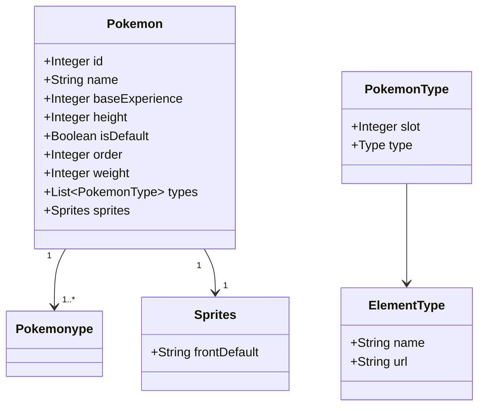

# RESTful API para consumir a PokéAPI

## Diagrama de classes

```mermaid
classDiagram
    class Pokemon {
        +Integer id
        +String name
        +Integer baseExperience
        +Integer height
        +Boolean isDefault
        +Integer order
        +Integer weight
        +List~PokemonType~ types
        +Sprites sprites
    }

    class PokemonType {
        +Integer slot
        +Type type
    }

    class ElementType {
        +String name
        +String url
    }

    class Sprites {
        +String frontDefault
    }

    Pokemon "1" --> "1..*" Pokemonype
    PokemonType --> ElementType
    Pokemon "1" --> "1" Sprites
```
