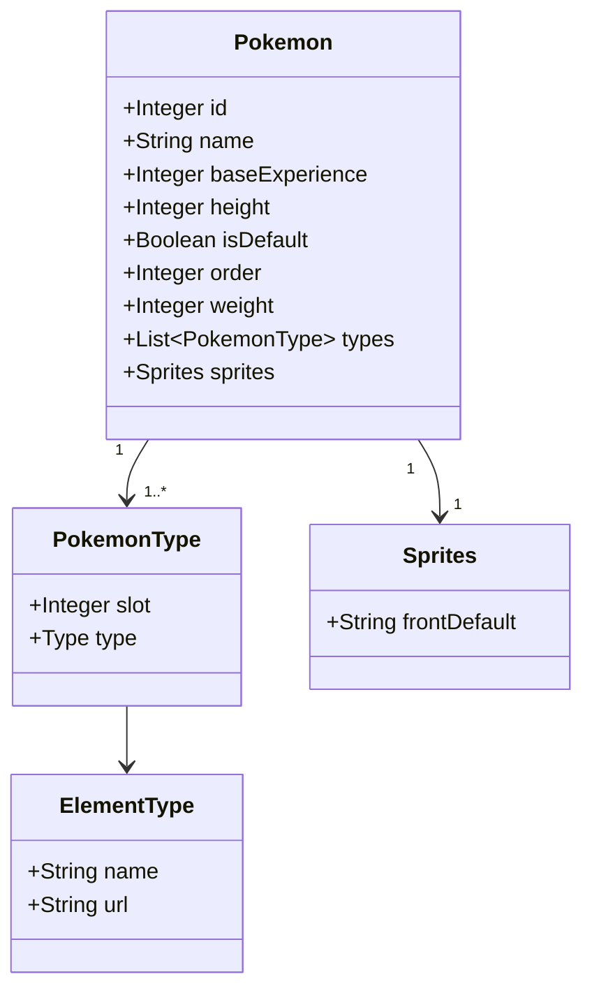

# PokéAPI RESTful API Consumption

This project is a RESTful API built with **Java 17** and **Spring Boot 3.5.4**, designed to consume data from the [PokéAPI](https://pokeapi.co/), persist Pokémon data in a PostgreSQL database (via JPA and Hibernate), and serve it via endpoints. The API is publicly accessible and deployed on [Railway](https://railway.app/). It was developed as a challenge for the Santander Java Bootcamp 2025

## Purpose

- Fetch a specific Pokémon from PokéAPI and store it in the PostgreSQL database.
- Retrieve Pokémon by ID or name, or list all stored Pokémon.
- Update or delete Pokémon entries in the database.

## Class Diagram




## Public Demo & Documentation

Access the public API and Swagger documentation here:  

**[https://poke-rest-api-2025-prd.up.railway.app/swagger-ui/index.html/](https://poke-rest-api-2025-prd.up.railway.app/swagger-ui/index.html/)**

## Endpoints

| Method | Endpoint                    | Description                                 |
|--------|-----------------------------|---------------------------------------------|
| GET    | `/pokemon/{id}`             | Get Pokémon by ID                           |
| PUT    | `/pokemon/{id}`             | Update Pokémon by ID                        |
| DELETE | `/pokemon/{id}`             | Delete Pokémon by ID                        |
| GET    | `/pokemon`                  | List all Pokémon stored in the database     |
| POST   | `/pokemon`                  | Fetch and store a Pokémon from PokéAPI      |
| GET    | `/pokemon/by-name/{name}`   | Get Pokémon by name                         |

## Data Model Example

Pokémon data is persisted with fields such as name, types, sprite URLs, etc.

```json
{
  "id": 1,
  "name": "bulbasaur",
  "height": 7,
  "order": 1,
  "weight": 69,
  "types": [
    {
      "slot": 1,
      "type": {
        "name": "grass",
        "url": "https://pokeapi.co/api/v2/type/12/"
      }
    },
    {
      "slot": 2,
      "type": {
        "name": "poison",
        "url": "https://pokeapi.co/api/v2/type/4/"
      }
    }
  ],
  "sprites": {
    "spritePreview": "",
    "front_default": "https://raw.githubusercontent.com/PokeAPI/sprites/master/sprites/pokemon/1.png"
  },
  "base_experience": 64,
  "is_default": true
}
```

## Database & Deployment

- **Railway PostgreSQL:** The database is deployed and ready for production use on Railway.
  
- **Local Development:** You can run it locally using PostgreSQL with the production profile.

## How To Use

- Send requests to the public endpoint or use Swagger for interactive exploration.
- Example `GET` request to retrieve Bulbasaur by ID:
  
```bash
curl https://poke-rest-api-2025-prd.up.railway.app/pokemon/1
```

## Technologies
- Java 17
- Spring Boot 3.5.4
- JPA & Hibernate
- PostgreSQL (local or Railway)
- PokéAPI for external data source
- Swagger for API documentation

## About
This project was developed as the final assignment for the Santander Java Bootcamp at DIO (Digital Innovation One).

## Contribution
Feel free to fork, open issues, or make pull requests.
No authentication required – open for public use!

## License
This project is for educational purposes (Bootcamp completion).
